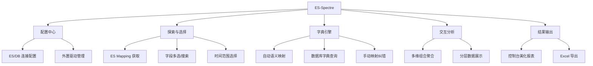

# ES-Spectre 用户行为分析终端工具需求规格说明书 (PRD)

| 项目名称 | ES-Spectre (ES 幽灵分析师) | 版本 | v1.0.0 (调试版) |
| :--- | :--- | :--- | :--- |
| **产品定位** | 一款集成 ES 数据聚合、异构数据库字典映射、多维交互展示的独立终端分析工具。 | **状态** | 需求定稿 |

---

## 1. 业务目标与愿景
解决安全运营或系统分析人员在面对 ES 原始日志时，**“统计难、下钻难、翻译难”** 的痛点。通过终端交互形式，快速实现：
*   **多维聚合**：不再写复杂的 JSON Query，通过点选实现字段交叉统计。
*   **语义转化**：自动将 ES 中的枚举值（1, 2, 3...）映射为数据库字典中的中文含义。
*   **零部署交付**：独立可执行文件，适配 Windows 环境，支持多种国产数据库驱动挂载。

---

## 2. 功能架构图

---

## 3. 详细功能说明

### 3.1 配置与基础设施管理 (Connection Hub)
*   **连接配置**：通过 `config.yaml` 或界面引导配置 ES 集群地址、索引名、数据库类型（MariaDB/达梦/金仓）、连接串、账号密码。
*   **驱动挂载库**：
    *   程序目录下级设 `drivers/` 文件夹。
    *   用户需将 `.dll` 或 `.so` 驱动文件放入指定位置，或在配置中指定驱动路径。
    *   程序启动时自动检测驱动可用性，并在状态栏显示。

### 3.2 ES 执行探索 (Exploration)
*   **Mapping 检索**：建立连接后，即时获取目标索引的所有字段（含嵌套字段）。
*   **字段智能看板**：
    *   **搜索与勾选**：支持模糊查询定位字段。
    *   **字段识别**：标识字段类型（Date, Keyword, Long 等）。
    *   **手动标记**：用户勾选需要进入聚合维度的字段（如 `source_app_type`, `hw_type`, `op_type`）。

### 3.3 时间维度控制 (Time Span)
*   **预设快捷项**：支持“近24小时”、“近7天”、“近30天”一键切换。
*   **动态窗口**：允许输入自定义时间范围（yyyy-MM-dd HH:mm:ss）。

### 3.4 核心：字典映射引擎 (Dictionary Engine)
这是本产品的**灵魂功能**，处理 ES 数值到业务语义的转化。
1.  **自动大写匹配规则**：
    *   获取 ES 字段名后，自动将其转为全大写（如 `source_app_type` -> `SOURCE_APP_TYPE`）。
    *   以此作为 `dict_code` 前往数据库字典表（统一结构：`dict_code`, `item_value`, `item_text`）检索。
2.  **异构数据库适配**：
    *   支持不同数据库字段名大小写的差异化处理（如 MariaDB 用小写字段名，达梦用大写，程序需根据数据库类型动态适配 SQL 模版）。
3.  **异常拦截与映射中心**：
    *   **自动匹配失败**：若字段名与字典编码不一致，或字典项中缺失。
    *   **交互纠错**：弹出一个模糊匹配字典编码的搜索列表，由用户选定对应字典，或直接手动输入别名。
    *   **结果回访**：支持对行为类型字段 `source_app_type` 进行同逻辑映射。

### 3.5 多维数据网格分析 (Aggregation View)
*   **多维组合**：执行 ES 的 `terms` 嵌套聚合。
*   **全局统计视图**：
    *   **首层**：行为类型统计（中文名 + 次数 + 占比百分比）。
    *   **下钻层**：在选中行的下方，分级展开该行为下的二级统计（如：主机硬件变更 -> 显示器: 5次, U盘: 10次）。
*   **视觉规范**：
    *   使用色彩区分不同字段。
    *   使用 ASCII 线条勾勒出表格边界，支持水平和竖直滚动。

### 3.6 结果产出 (Export)
*   **实时导出**：界面底端常驻 `Ctrl+E` 导出选项。
*   **Excel 增强版**：导出结果需包含：原始字段名、已映射中文名、统计计数值、占比情况。如果是多维数据，Excel 需通过合并单元格或分级缩进展示层级关系。

---

## 4. 关键交互流程设计 (User Flow)

1.  **启动 (Initialization)**：自检配置与数据库驱动 -> 建立连接。
2.  **选择 (Selection)**：
    *   输入时间范围。
    *   空格键勾选要统计的字段（如 1, 3, 5 号字段）。
3.  **映射 (Mapping Check)**：
    *   程序检测字段对应的字典是否存在。
    *   红色高亮显示“未映射字段”，用户回车进入搜索界面进行绑定。
4.  **计算与展示 (Processing & Render)**：
    *   显示加载动画（Spinner）。
    *   渲染多维统计网格，用户可通过方向键上下移动查看详情。
5.  **导出 (Exporting)**：点击确认，生成 `.xlsx` 文件到 `export/` 目录。

---

## 5. 非功能性需求 (Non-functional)

*   **性能要求**：ES 聚合查询响应时间控制在 3s 内；字典映射采用按需查询 + 内存 LRU 缓存。
*   **安全性**：配置中的数据库密码支持加密存储。
*   **兼容性**：支持 Windows 10/11 终端。
*   **美观度**：遵循现代 TUI 设计美学（使用 Lipgloss 库进行配色）。
