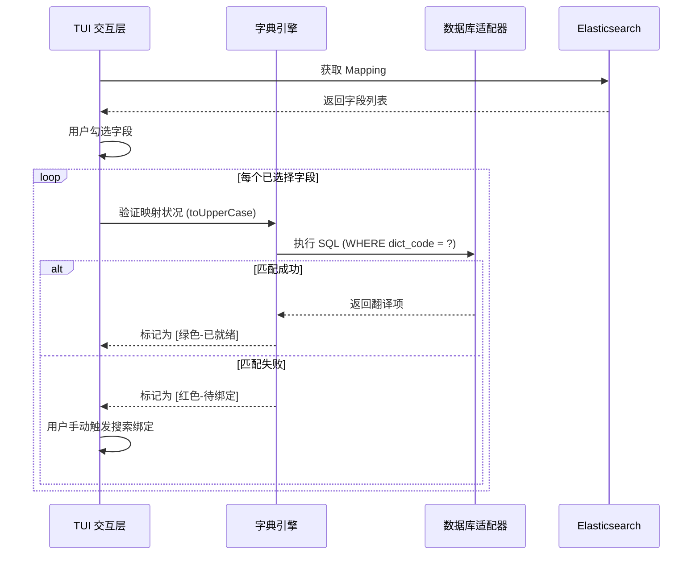

# ES-Spectre 后端架构设计与开发手册 (Backend & Architecture)

| 角色 | 项目经理 & 首席架构师 | 版本 | v1.0.0 |
| :--- | :--- | :--- | :--- |
| **项目背景** | 基于 Go 语言的交互式终端行为分析系统 | **核心原则** | 模块解耦、异构兼容、极致性能 |

---

## 〇、 技术栈清单 (Technology Stack)

为了实现高性能、美观且易于分发的终端应用，本项目选定以下技术栈：

| 维度 | 技术选型 | 核心理由 |
| :--- | :--- | :--- |
| **编程语言** | Go (Golang) 1.20+ | 原生编译为独立 `.exe`，高并发处理 ES 与 数据库交互。 |
| **TUI 核心框架** | [Bubble Tea](https://github.com/charmbracelet/bubbletea) | 业界最先进的 Elm 架构终端 UI 框架，支持复杂状态管理。 |
| **样式与布局** | [Lipgloss](https://github.com/charmbracelet/lipgloss) | 基于自适应终端色彩的样式定义库，实现 Cyberpunk 级视觉效果。 |
| **ES 客户端** | [go-elasticsearch](https://github.com/elastic/go-elasticsearch) | 官方高性能客户端，完美支持 7.x/8.x 的 DSL 构造。 |
| **数据库 ORM/SQL** | `database/sql` + `sqlx` | 标准库接口，兼容 MariaDB、达梦 (dm)、金仓 (kingbase) 的三方驱动。 |
| **配置管理** | [Viper](https://github.com/spf13/viper) | 支持 YAML/JSON 多格式配置读取，支持内存动态注入。 |
| **Excel 导出** | [Excelize](https://github.com/qax-os/excelize) | 功能最全的 Go 语言 Excel 处理库，支持层级缩进与图表生成。 |
| **驱动动态加载** | `purego` / `cgo` | 针对国产数据库 `.dll` 驱动包的底层调用方案。 |

---

## 一、 工程目录结构 (Project Layout)

遵循标准 Go 项目布局，确保代码的可维护性和可扩展性。

```text
es-spectre/
├── cmd/
│   └── spectre/
│       └── main.go           # 程序入口，初始化 TUI 循环
├── internal/
│   ├── config/               # 配置管理 (yaml 解析, 驱动路径管理)
│   ├── ui/                   # TUI 界面层 (Bubble Tea Models)
│   │   ├── components/       # 可复用 UI 组件 (List, Spinner, Table)
│   │   └── pages/            # 业务页面 (Explorer, Mapper, Dashboard)
│   ├── service/              # 核心业务逻辑
│   │   ├── es_client.go      # ES 聚合与 Mapping 获取
│   │   ├── dict_engine.go    # 字典匹配引擎 (核心)
│   │   ├── aggregator.go     # 多维统计逻辑处理
│   │   └── exporter.go       # Excel / CSV 导出逻辑
│   ├── repository/           # 数据访问层
│   │   ├── db_adapter.go     # 数据库访问接口
│   │   └── adapters/         # 适配器实现 (MariaDB, Dameng, Kingbase)
│   └── model/                # 领域模型 (Entity, DTO)
├── pkg/
│   ├── driver/               # 动态驱动加载工具类
│   └── util/                 # 工具函数 (字符串处理、大写转换)
├── drivers/                  # 用户手动存放数据库驱动 (.dll/.so)
├── resources/                # SQL 模板、静态资源
├── configs/                  # 默认配置文件
├── go.mod
└── README.md
```

---

## 二、 核心流程设计 (Process Flow)

### 1. 字典映射生命周期 (Critical Path)


---

## 三、 逻辑结构设计 (Logical Design)

### 1. 异构数据库适配层 (DB Adapter Interface)
针对 MariaDB、达梦、金仓，定义统一接口，屏蔽底层驱动差异。
```go
type DictRepository interface {
    // 根据字段名搜索对应的字典项
    QueryDictItems(dictCode string) ([]model.DictItem, error)
    // 模糊搜索字典编码 (用于手动映射)
    SearchDictCodes(keyword string) ([]string, error)
    // 获取当前连接状态
    Ping() error
}
```

### 2. 字典匹配引擎逻辑
*   **规则引擎**：输入 `field_name` -> `strings.ToUpper(field_name)` -> 数据库检索 `dict_code`。
*   **缓存策略**：引入本地 LRU 缓存，缓存已查询过的字典项，避免聚合查询结果集过大时频繁请求数据库。

### 3. 多维聚合 DSL 构造器
将用户在界面上勾选的 `[FieldA, FieldB, FieldC]` 序列，动态编译为 ES 的嵌套聚合请求（Terms Aggregation Hierarchy）。

---

## 四、 任务拆解与里程碑 (Milestones)

### 第一阶段：基础设施与配置 (预计 1 天)
*   [ ] 初始化 Go 项目与依赖管理。
*   [ ] 实现 `yaml` 配置文件读写。
*   [ ] 实现基础的闪屏 UI 和配置文件校验逻辑。

### 第二阶段：数据源驱动适配 (预计 2 天)
*   [ ] 实现 ES 客户端，封装 Mapping 获取方法。
*   [ ] 实现统一 DB 适配层。
*   [ ] 重点：编写针对**达梦/金仓**驱动的动态加载/静态链接测试代码。
*   [ ] 编写适配不同数据库大小写敏感性的 SQL 模板。

### 第三阶段：字典引擎与手动映射 (预计 2 天)
*   [ ] 开发字典自匹配算法（大写逻辑）。
*   [ ] 开发 TUI “映射实验室”界面：实现模糊搜索字典、实时预览翻译结果。
*   [ ] 实现映射关系的本地化存储（下次启动免配置）。

### 第四阶段：聚合仪表盘与交互 (预计 2 天)
*   [ ] 编写 ES 嵌套聚合逻辑。
*   [ ] 实现“阶梯式多维数据表”渲染组件。
*   [ ] 加入 Bubble Tea 的状态流转逻辑（从选择字段到展示结果）。

### 第五阶段：导出与优化 (预计 1 天)
*   [ ] 集成并封装 `excelize` 库，实现多层级 Excel 导出。
*   [ ] 各模块性能调优（ES 聚合深度优化、DB 连接池管理）。

---

## 五、 开发要点与注意事项

1.  **异常捕获**：终端应用最忌讳 Panic 导致程序消失。必须在 TUI 循环层捕捉所有异常，并以“气泡提示”展示给用户。
2.  **驱动兼容性**：国产数据库（如达梦）在 Windows 下可能需要 `.dll`。开发时需关注 `CGO_ENABLED` 的环境变量设置。
3.  **大内存处理**：如果聚合结果集超过 1 万行，必须在 Service 层做分页处理，UI 层只负责渲染视口（Viewport）内的肉眼可见行。
4.  ** source_app_type 行为映射**：作为固定首选字段，该字段的映射逻辑需在程序启动时强制执行并存入全局 Context。

---
**本手册作为后端开发人员的技术准则。**
